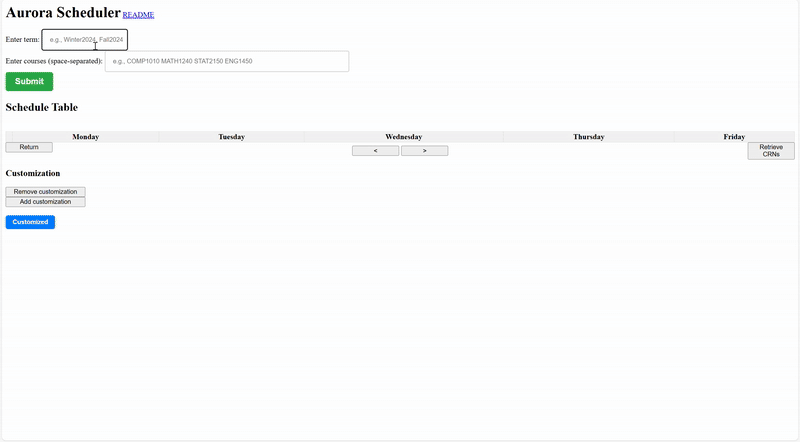

# Aurora scheduler

This website helps UofM students plan their class schedules easily before registration. It was first released a year ago on [reddit](https://www.reddit.com/r/umanitoba/comments/1dn3ls9/this_website_helps_you_plan_your_class_schedules/).

It takes in user input, which are the courses they want to take in a semester. Then, using real-time data scrapped from Aurora, it shows all possible scheduling options for the user's registration (no class overlaps). It also recommends the best option with the fewest class days and minimal time gaps between classes. 

The customization section allows the user to view schedules that accommodate their specific time preferences.

<!-- This website is still under development with more features and improvements to come. -->
There might be more features and improvements to come.

### Usage

* Enter the term and courses then click `Submit` (or press `Enter`).
* Select a time period (days and times) when classes should not be scheduled, then click `Customized`.
* Use the navigation buttons to browse through different schedule options (or press `←` and `→`).
* Click on a class in the table to view more information about it.
* Click the `Retrieve CRNs` button to view the schedule's CRN list for easy registration.

### Contributors

* [Duc Do](https://github.com/ducdonghiem) - dod2@myumanitoba.ca
* [Minh Do](https://github.com/DNgMinh) - minh.do.nghiem@gmail.com

*Contact us if you have questions, suggestions or want to run this web app locally.*

<!-- ### Repo

[Public repository](https://github.com/ducdonghiem/AuroraProject_Showcase) for this website. -->

<!-- ### For robobison project showcase -->

<!-- Video presentation and project description can be found [here](https://drive.google.com/drive/folders/1sF3IGaa-7E9NDiv76rmogJyMl-Xq3OSS). -->
